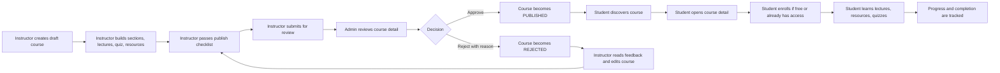

# Course Remaining Implementation Plan

Tai lieu nay gom phan con lai cua module Course, di theo vong doi tu Admin den Instructor va Student. Phan cart, checkout, payment provider, payout va order accounting chua nam trong scope luc nay.

## 1. Current Baseline

Da co:

- Instructor sidebar va Admin sidebar rieng theo role.
- Instructor My Courses, create course, quick edit course.
- Course Studio cho instructor:
  - Sections CRUD.
  - Lectures CRUD voi content type: `ARTICLE`, `VIDEO`, `QUIZ`, `FILE`, `EXTERNAL_LINK`.
  - Lecture Preview / Detail Studio.
  - Article markdown editor va renderer.
  - Quiz config, question CRUD, import JSON.
  - Resources gan theo lecture.
  - Publish checklist va submit course for review.
- Admin Course Reviews triage list:
  - Filter status: `PENDING_REVIEW`, `PUBLISHED`, `REJECTED`.
  - Filter instructor, category, keyword.
  - Sort submitted/updated/title.
  - Columns: course title, instructor, category, status, sections/lectures/quizzes, date, checklist, action.

Chua lam:

- Admin review detail dung nghia.
- Approve/reject course co reason.
- Review history.
- Instructor nhan feedback rejected va resubmit.
- Student learning experience day du sau khi course duoc publish.
- Progress, quiz taking, resource access, completion/certificate.

## 2. Out Of Scope For Now

Chua lam trong phase nay:

- Cart page.
- Checkout page.
- Payment success/failed/canceled.
- Paid enrollment transaction.
- Instructor revenue, payout, order settlement.

Co the lam free enrollment / manual enrollment neu can de test student learning flow, nhung khong gan voi payment.

## 3. Target Course Lifecycle



## 4. Admin Scope

### 4.1 Admin Course Review Detail

Route:

- Frontend: `/admin/course-reviews/:courseId`
- Backend: `GET /admin/course-reviews/{courseId}`

Purpose:

- Admin xem sau hon course triage list.
- Khong edit course truc tiep trong page nay.
- Page nay dung de approve/reject hoac di den preview tung lecture.

UI nen co:

- Header:
  - Course title.
  - Status badge.
  - Instructor.
  - Category.
  - Submitted/updated date.
  - Actions: `Approve`, `Reject`.
- Checklist panel:
  - Ready / not ready.
  - Group theo course info, curriculum, quiz, pricing.
  - Item failed/warning co link den target neu co.
- Curriculum panel:
  - Sections sorted by `displayOrder`.
  - Lectures sorted by `displayOrder`.
  - Hien content type, published state, duration, preview action.
- Course basic info panel:
  - Thumbnail.
  - Description.
  - Level/language/free/price.
  - Learning outcomes, requirements, target audience.
- Review history panel:
  - Admin reviewer.
  - Action.
  - Reason.
  - Created date.

Action behavior:

- `Approve` chi enabled khi course status la `PENDING_REVIEW`.
- `Reject` chi enabled khi course status la `PENDING_REVIEW`.
- Reject bat buoc nhap reason.
- Sau approve/reject invalidate:
  - Admin course reviews list.
  - Admin review detail.
  - Course detail/studio cache.

### 4.2 Approve / Reject API

Backend endpoints:

- `POST /admin/course-reviews/{courseId}/approve`
- `POST /admin/course-reviews/{courseId}/reject`

Reject request:

```json
{
  "reason": "The course needs at least one complete quiz and clearer lecture descriptions."
}
```

Approve rules:

- Actor must be `ADMIN`.
- Course must be `PENDING_REVIEW`.
- Publish checklist should still be valid.
- Set `course.status = PUBLISHED`.
- Set `publishedAt = now` if empty.
- Emit `course.published` event for indexing/search if current backend expects it.
- Write review history action `APPROVED`.

Reject rules:

- Actor must be `ADMIN`.
- Course must be `PENDING_REVIEW`.
- Reason is required.
- Set `course.status = REJECTED`.
- Write review history action `REJECTED` with reason.

Error codes nen co:

- `COURSE_NOT_FOUND`
- `UNAUTHORIZED`
- `COURSE_REVIEW_INVALID_STATUS`
- `COURSE_NOT_FULLY_COMPLETED`
- `REVIEW_REASON_REQUIRED`

### 4.3 Review History Data Model

New table/entity:

`course_review_history`

Fields:

- `id`
- `course_id`
- `reviewer_id`
- `action`: `SUBMITTED`, `APPROVED`, `REJECTED`, `RESUBMITTED`
- `from_status`
- `to_status`
- `reason`
- `created_at`
- `updated_at`

Why:

- Admin can audit every decision.
- Instructor can see latest rejected reason.
- Later notification/email can use this table.

### 4.4 Admin List Improvements After Detail Exists

Once detail page is done:

- `Review` button should route to `/admin/course-reviews/:courseId`.
- Add quick status chips but keep list light.
- Add "Needs attention" filter later if checklist failed/warning.
- Keep admin list for triage only, not deep review.

## 5. Instructor Scope

### 5.1 Rejected Feedback In My Courses

Where:

- `/instructor/courses`
- `/instructor/studio/:courseId`

Display when status is `REJECTED`:

- A compact rejected alert.
- Latest reject reason.
- Reviewer and date if available.
- CTA:
  - `Edit course`
  - `Open Studio`
  - `Submit again` only when checklist ready.

Backend support:

- `GET /courses/{courseId}/review-history`
- Or include `latestReview` in `CourseResponse` for owner/admin.

Preferred:

- Add a small response object:

```json
{
  "id": "review-id",
  "action": "REJECTED",
  "reason": "Reason text",
  "reviewer": {},
  "createdAt": "..."
}
```

### 5.2 Resubmit Flow

Current submit API can stay:

- `POST /courses/{courseId}/submit-review`

Needed behavior:

- Allow statuses:
  - `DRAFT`
  - `REJECTED`
  - `UNPUBLISHED` if used as editable unpublished state.
- Disallow:
  - `PENDING_REVIEW`
  - `PUBLISHED`
  - `ARCHIVED`
- Write review history action:
  - First submit: `SUBMITTED`
  - After rejected: `RESUBMITTED`

### 5.3 Course Studio Polish

Keep Studio as overview:

- Sections tab: section CRUD.
- Lectures tab: lecture metadata CRUD.
- Quiz tab: quiz overview by section.
- Resources tab: lecture resource management.
- Publish checklist tab: readiness and submit.

Deep lecture work stays in Lecture Detail Studio:

- Article content editing.
- Quiz config and questions.
- Resource editing for lecture.
- Future video upload/config.

Remaining instructor improvements:

- Reorder sections and lectures.
- Better video support:
  - `videoUrl` or uploaded video file.
  - duration and thumbnail.
  - preview player.
- Resource metadata:
  - title
  - url
  - type
  - downloadable
  - file size after upload feature.
- Autosave/draft indicator later, not required for MVP.

## 6. Student Scope

### 6.1 Course Discovery

Current discovery exists, but student-facing polish should include:

- Search/filter/sort using backend contract.
- Stable empty/loading/error states.
- Pagination consistent on desktop/mobile.
- Only show `PUBLISHED` courses for public/student discovery.
- Course card should show:
  - Title.
  - Instructor.
  - Category.
  - Level.
  - Rating/reviews.
  - Duration/lectures.
  - Free/paid label.

No payment behavior yet:

- Paid course can show locked CTA or "Payment coming soon".
- Free course can allow enrollment if backend supports it.

### 6.2 Course Detail

Course detail should use real data for:

- Course overview.
- Instructor.
- Sections.
- Lectures.
- Quiz summary.
- Resources summary.
- Enrollment/access status.

Display states:

- `FREE`: can enroll or start.
- `ENROLLED`: can continue learning.
- `LOCKED`: visible but content locked.
- `COMPLETED`: show completed state.

Do not expose unpublished content to normal student users.

### 6.3 My Learning

Route:

- `/learning`
- Or `/my-learning`

Purpose:

- Student sees enrolled courses.
- Continue course quickly.
- Track progress.

List/card fields:

- Course thumbnail/title.
- Instructor.
- Progress percentage.
- Completed lectures / total lectures.
- Last accessed lecture.
- CTA: `Continue`.

Backend likely needed:

- `GET /learning/my-courses`
- `GET /learning/courses/{courseId}/progress`

### 6.4 Student Course Learn Page

Route:

- `/learning/courses/:courseId`
- `/learning/courses/:courseId/lectures/:lectureId`

Reuse:

- `CourseLectureSidebar` can be shared between instructor preview and student learning.

Layout:

- Left curriculum sidebar:
  - Sections collapsible.
  - Lectures inside section.
  - Completed/current/locked states.
  - Overflow-y-auto.
  - Collapsible.
- Main content:
  - ARTICLE: render markdown.
  - VIDEO: video player later.
  - QUIZ: quiz attempt UI.
  - FILE/EXTERNAL_LINK: resource panel.
- Header/action:
  - Back to My Learning.
  - Mark complete / Next lecture.

Access rules:

- Student can view free preview lectures without enrollment.
- Enrolled students can view available lectures.
- Locked lectures show locked state.
- Instructor/admin preview bypasses student access rules.

### 6.5 Lecture Progress

Needed actions:

- Mark lecture complete.
- Track video progress later.
- Store last accessed lecture.

Backend endpoints:

- `POST /learning/lectures/{lectureId}/complete`
- `POST /learning/lectures/{lectureId}/progress`
- `GET /learning/courses/{courseId}/progress`

Progress data:

- `completedLectureIds`
- `completedLectures`
- `totalLectures`
- `progressPercentage`
- `lastAccessedLectureId`
- `completedAt`

### 6.6 Student Quiz Taking

Teacher quiz authoring already exists. Student side still needs:

- Start quiz attempt.
- Render questions/options.
- Submit answers.
- Calculate score.
- Show pass/fail.
- Respect:
  - time limit
  - passing score
  - max attempts
  - randomize questions
  - show correct answers
  - show answers after submission

Backend endpoints:

- `POST /quizzes/{quizId}/attempts`
- `GET /quiz-attempts/{attemptId}`
- `POST /quiz-attempts/{attemptId}/submit`
- `GET /quizzes/{quizId}/my-attempts`

Rules:

- Only enrolled/free-access users can attempt.
- Do not send correct answers before submission.
- If `showCorrectAnswers` is false, hide correct answer detail.
- If `showAnswersAfterSubmission` is false, show only score/result.

### 6.7 Resources For Students

Student view:

- Show lecture resources as clean list.
- Open external resources in new tab.
- Download only if lecture/resource is downloadable.

Backend later:

- If resources become uploaded files, use signed URL or protected download endpoint.

### 6.8 Completion And Certificate

After progress + quiz attempts:

- Mark course completed when required lectures are completed.
- If course has required quiz, completion may require passing quiz.
- Certificate can be generated later.

Minimal MVP:

- Show `Completed` badge.
- Store `completedAt`.

Later:

- Certificate page.
- Certificate verification URL.

## 7. Recommended Implementation Order

### Phase 1 - Admin Review Decision

Goal:

- Close instructor publish lifecycle.

Tasks:

1. Add `course_review_history` backend entity/repository.
2. Add admin review detail API.
3. Add approve/reject APIs.
4. Add admin review detail page.
5. Route list `Review` button to admin detail.
6. Add reject reason dialog.
7. Commit.

### Phase 2 - Instructor Rejection Feedback

Goal:

- Instructor understands why course was rejected and can resubmit.

Tasks:

1. Expose latest review feedback to course owner.
2. Show rejected alert in My Courses.
3. Show rejected alert in Course Studio.
4. Allow resubmit from `REJECTED` after checklist passes.
5. Commit.

### Phase 3 - Student Course Detail And Free Enrollment

Goal:

- Student can discover, enroll free course, and enter learning flow.

Tasks:

1. Ensure discovery only shows `PUBLISHED`.
2. Make course detail use real curriculum/access status.
3. Add free enrollment CTA.
4. Add My Learning page.
5. Commit.

### Phase 4 - Student Learning Page

Goal:

- Student consumes course content.

Tasks:

1. Build reusable learning layout using `CourseLectureSidebar`.
2. Render article content.
3. Render resource/file/external link content.
4. Add mark lecture complete.
5. Track progress.
6. Commit.

### Phase 5 - Student Quiz Attempts

Goal:

- Student can take quizzes authored by teacher.

Tasks:

1. Add quiz attempt backend if not complete.
2. Add quiz attempt page/component.
3. Hide correct answers before submit.
4. Show result based on config.
5. Store attempt history.
6. Commit.

### Phase 6 - Completion Polish

Goal:

- Course feels complete without payment.

Tasks:

1. Course completion state.
2. Completed course UI in My Learning.
3. Basic certificate placeholder if needed.
4. Improve empty/loading/error states across student course pages.
5. Commit.

## 8. API Summary

Admin:

- `GET /admin/course-reviews`
- `GET /admin/course-reviews/{courseId}`
- `POST /admin/course-reviews/{courseId}/approve`
- `POST /admin/course-reviews/{courseId}/reject`

Instructor:

- `GET /courses/{courseId}/review-history`
- `POST /courses/{courseId}/submit-review`

Student:

- `GET /learning/my-courses`
- `GET /learning/courses/{courseId}/progress`
- `POST /learning/lectures/{lectureId}/complete`
- `POST /learning/lectures/{lectureId}/progress`
- `POST /quizzes/{quizId}/attempts`
- `GET /quiz-attempts/{attemptId}`
- `POST /quiz-attempts/{attemptId}/submit`
- `GET /quizzes/{quizId}/my-attempts`

## 9. Acceptance Checklist

Admin:

- Admin can list submitted courses.
- Admin can open detail.
- Admin can approve.
- Admin can reject with reason.
- Review history is stored.

Instructor:

- Instructor sees rejected reason.
- Instructor can fix course.
- Instructor can resubmit.

Student:

- Student only sees published courses.
- Student can open course detail with real curriculum.
- Student can enroll/access free course.
- Student can learn lectures.
- Student progress updates.
- Student can take quiz.

Excluded:

- No checkout.
- No payment result page.
- No payout/revenue accounting.
