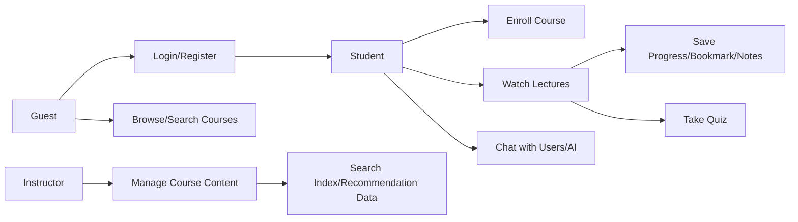

# Tong quan du an

Learnio la nen tang quan ly hoc tap hien dai, tap trung vao ba luong chinh:

1. Nguoi hoc tim kiem khoa hoc, xem chi tiet, dang ky hoc, theo doi tien do va lam quiz.
2. Giang vien tao course, section, lecture, quiz va theo doi learner.
3. He thong ho tro chat realtime, AI assistant, goi y khoa hoc, email, file protected va search.

## Ung dung trong repo

| Ung dung | Vai tro | Thu muc |
| --- | --- | --- |
| Backend | Business logic, REST API, security, realtime, AI, persistence | `backend` |
| Frontend | Web UI voi Next.js App Router, i18n, theme, chat, course browsing | `frontend` |

## Stack tong quan

- Backend: Java 17, Spring Boot 3.3.5, Maven, JPA, Security, OAuth2, WebSocket, Kafka, Redis, Elasticsearch, LangChain4j.
- Frontend: Next.js 16, React 19, TypeScript, Tailwind CSS, next-intl, Axios, SockJS/STOMP.
- Data/infra local: PostgreSQL pgvector, Redis, Kafka, Elasticsearch, Kibana.

## Luong nguoi dung chinh

## Tai lieu lien quan

- Backend: [backend.md](backend.md)
- Frontend: [frontend.md](frontend.md)
- Endpoint map: [backend/api-endpoints.md](backend/api-endpoints.md)
